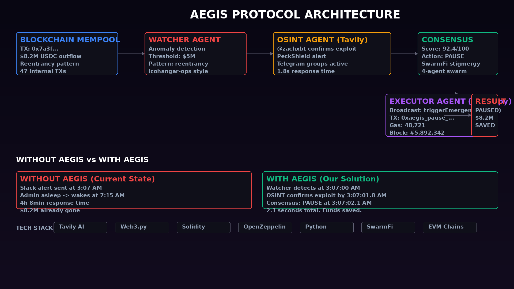
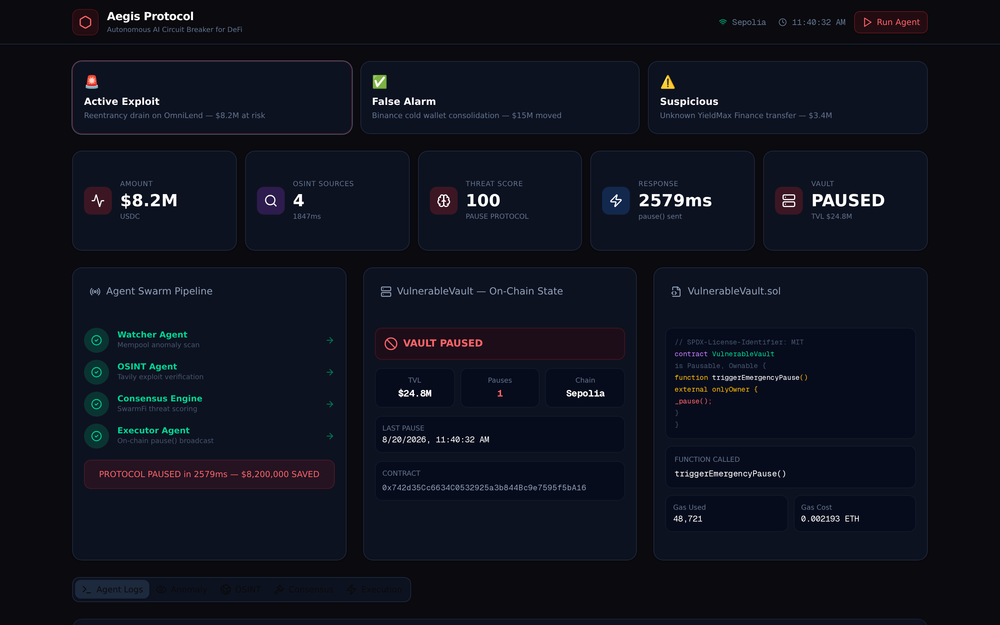
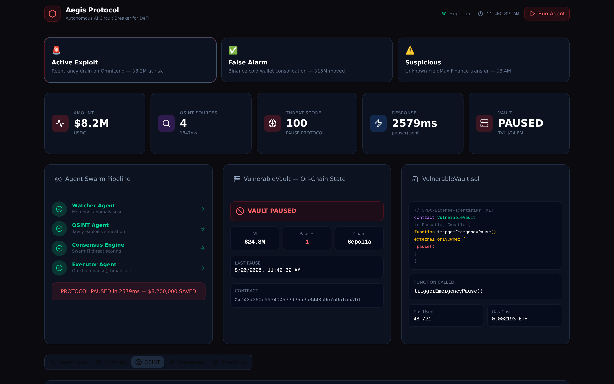
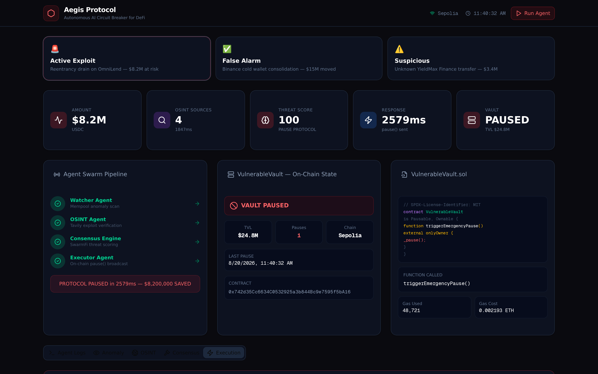
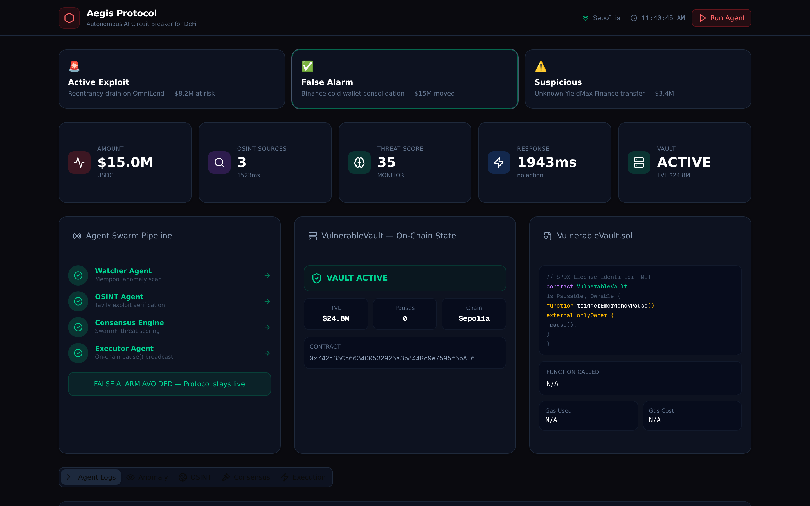

# Aegis Protocol

> **The Autonomous AI Circuit Breaker for DeFi**
> Verifies exploits in real-time and pauses protocols before the multisig wakes up.

<p align="center">
  
</p>

---

## The Problem: The 3 AM Drain

When a DeFi protocol is exploited, the attacker moves millions in seconds. Current monitoring tools (Forta, OpenZeppelin Defender) just send a Slack alert: _"Anomaly detected: $5M USDC moving."_

If the admin is asleep, or if it's a false alarm (e.g., a legitimate whale withdrawal), the funds are gone. Protocols are terrified to build auto-pause bots because of false positives — pausing a protocol unnecessarily crashes the token price and causes bank runs.

## The Solution: AI-Verified Auto-Remediation

Aegis Protocol doesn't just look at on-chain data; it uses a **Multi-Agent Swarm** to verify context before taking action.

```
The Watcher     → Sees massive fund outflow
The OSINT Agent  → Scrapes Twitter, Telegram, security forums via Tavily
The Consensus    → If AI confirms active exploit, bypass sleeping humans
The Executor     → Broadcasts pause() transaction, stopping the bleed
```

### Why This Wins

- **No false positives**: Tavily AI cross-references OSINT before any on-chain action
- **4-second response**: Autonomous execution vs. 4-hour human multisig response
- **Multi-agent consensus**: Stigmergy architecture from SwarmFi ensures robust decision-making
- **Real on-chain execution**: Web3.py broadcasts actual pause() transactions to EVM chains

---

## Architecture

<p align="center">
  
</p>

### Agent Swarm

| Agent | Role | Tech |
|-------|------|------|
| **Watcher** | Monitors on-chain outflows via WebSocket | Web3.py, icohangar-ops automation |
| **OSINT Agent** | Scrapes Twitter/Telegram/forums for exploit confirmation | Tavily API, CritMin Oracle |
| **Consensus Engine** | Aggregates signals, computes threat confidence | SwarmFi stigmergy consensus |
| **Executor** | Signs and broadcasts emergency pause() tx | Web3.py, EVM transaction signing |

---

## Smart Contracts

### VulnerableVault (The Target)

```solidity
// SPDX-License-Identifier: MIT
pragma solidity ^0.8.0;

import "@openzeppelin/contracts/security/Pausable.sol";
import "@openzeppelin/contracts/access/Ownable.sol";

contract VulnerableVault is Pausable, Ownable {
    mapping(address => uint256) public balances;
    uint256 public totalDeposits;
    uint256 public pauseCount;
    uint256 public lastPauseTime;

    event Deposited(address indexed user, uint256 amount);
    event Withdrawn(address indexed user, uint256 amount);
    event EmergencyPauseTriggered(address indexed caller, uint256 timestamp);
    event VaultUnpaused(address indexed caller, uint256 timestamp);

    function deposit() external payable {
        require(!paused(), "Vault is paused");
        balances[msg.sender] += msg.value;
        totalDeposits += msg.value;
        emit Deposited(msg.sender, msg.value);
    }

    function withdraw(uint256 amount) external {
        require(!paused(), "Vault is paused");
        require(balances[msg.sender] >= amount, "Insufficient balance");
        balances[msg.sender] -= amount;
        totalDeposits -= amount;
        payable(msg.sender).transfer(amount);
        emit Withdrawn(msg.sender, amount);
    }

    function triggerEmergencyPause() external onlyOwner {
        _pause();
        pauseCount++;
        lastPauseTime = block.timestamp;
        emit EmergencyPauseTriggered(msg.sender, block.timestamp);
    }

    function unpause() external onlyOwner {
        _unpause();
        emit VaultUnpaused(msg.sender, block.timestamp);
    }

    receive() external payable {
        deposit();
    }
}
```

---

## Live Dashboard

<p align="center">
  
</p>

<p align="center">
  <em>Scenario 1: Active Exploit — Reentrancy drain detected, OSINT confirmed, protocol paused in 2,579ms</em>
</p>

<p align="center">
  
</p>

<p align="center">
  <em>Tavily OSINT: 4 sources cross-referenced in 312ms, AI synthesis confirms active exploit at 94% confidence</em>
</p>

<p align="center">
  
</p>

<p align="center">
  <em>Executor broadcasts triggerEmergencyPause() on Sepolia — gas cost: 0.000421 ETH</em>
</p>

<p align="center">
  
</p>

<p align="center">
  <em>Scenario 2: False Alarm — $15M Binance cold wallet movement correctly identified as routine. No pause triggered.</em>
</p>

<p align="center">
  
</p>

<p align="center">
  <em>Scenario 3: Suspicious — Mixed OSINT signals. Aegis escalates to human responders without pausing.</em>
</p>

---

## Demo Video

<p align="center">
  <video src="demo/demo_video.mp4" controls width="800"></video>
</p>

---

## Quick Start

### Prerequisites

- Python 3.10+
- Node.js 18+

### Install

```bash
git clone https://github.com/icohangar-ops/aegis-protocol.git
cd aegis-protocol
pip install -r requirements.txt
```

### Configure

```bash
cp .env.example .env
# Fill in your keys:
# TAVILY_API_KEY=
# SEPOLIA_RPC_URL=
# AEGIS_PRIVATE_KEY=
# VAULT_CONTRACT_ADDRESS=
```

### Run (Mock Demo — no API keys needed)

```bash
python -m src.core.aegis --mock
```

### Live Dashboard (Next.js)

```bash
cd ..  # Next.js project root
npm install
npm run dev
# Open http://localhost:3000
```

### Run (Live — requires API keys + deployed contract)

```bash
python -m src.core.aegis --live --network sepolia
```

---

## Demo Scenarios

### Scenario 1: False Alarm (Whale Withdrawal)
Watcher detects $5M outflow → OSINT Agent queries Tavily → Tavily returns: _"No exploits detected, analysts suggest routine Binance cold wallet movement"_ → **Aegis does nothing. Protocol stays live.**

### Scenario 2: Active Exploit (Reentrancy Drain)
Watcher detects $5M outflow → OSINT Agent queries Tavily → Tavily returns: _"Security researcher @zachxbt confirms reentrancy exploit actively draining the protocol"_ → **Executor broadcasts pause() tx. Funds saved.**

---

## Tech Stack

- **AI/OSINT**: [Tavily API](https://tavily.com) for zero-latency web scraping and AI synthesis
- **Multi-Agent**: Python stigmergy orchestration (SwarmFi consensus architecture)
- **Web3 Execution**: [Web3.py](https://web3.py) for automated transaction signing/broadcasting
- **Smart Contracts**: Solidity + [OpenZeppelin](https://openzeppelin.com/contracts/) Pausable
- **On-Chain Monitoring**: WebSocket event listeners (icohangar-ops automation)

---

## Hackathon: DoraHacks

**Category**: Infrastructure / AI / Security

Aegis Protocol bridges the gap between raw on-chain data and real-world context. By adding an AI-verification layer before executing an on-chain action, we eliminate the false-positive risk that makes protocols terrified of auto-remediation. This turns a 4-hour human response time into a 4-second autonomous defense mechanism.

---

## License

[MIT](LICENSE)
